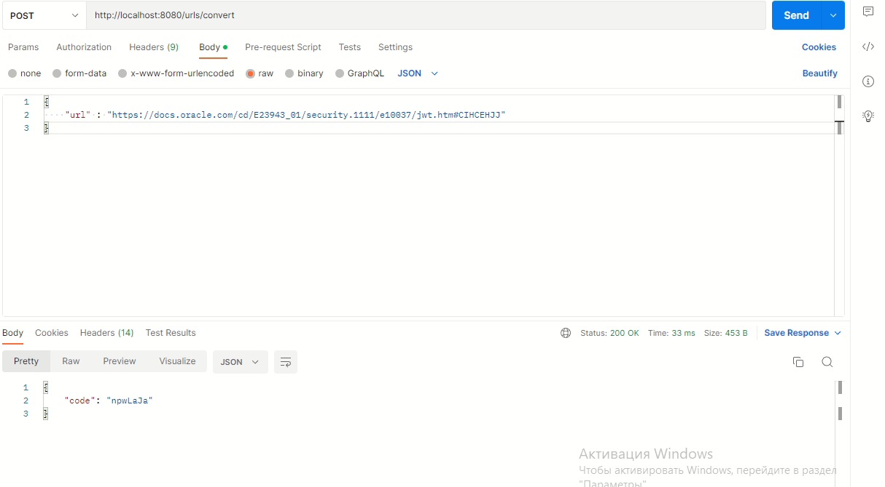
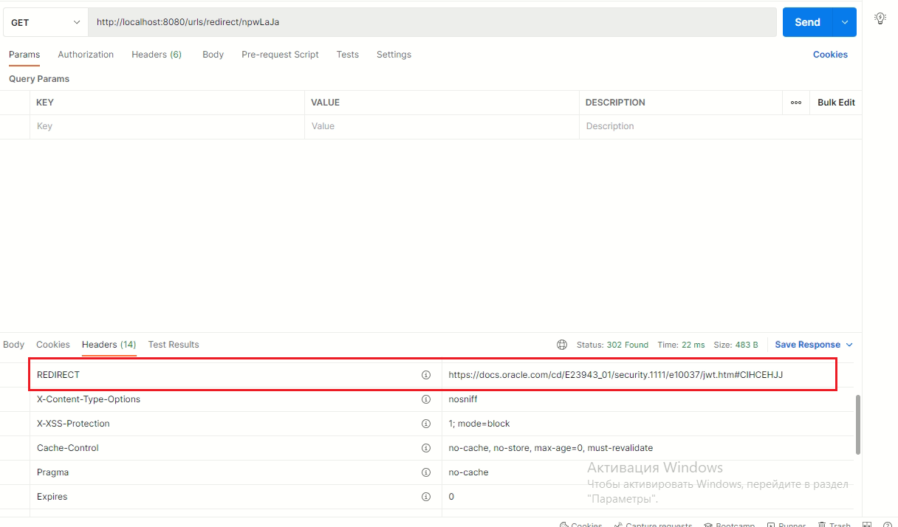

# job4j_url_shortcut

## Описание

Сервис предназначено для организации безопасности пользователей.
Каждый зарегистрированный на сервисе пользователь может добавить URL-адрес и получить короткую ссылку на него.
Все ссылки на сайте который работает с сервисом заменяются ссылками на сервис.

Проект реализован по принципу RestFull API архитектуры.

## Технологии

 - Java 17
 - PostgreSQL
 - Hibernate
 - Spring Boot 2
 - Spring Data JPA
 - Spring Security
 - JWT

## Требования к окружению

 - Java 17
 - Apache Maven 3.8.1
 - PostgreSQL 14

## Запуск приложения

 - Запустите утилиту pgAdmin 4
 - Введите пароль
 - В меню Object выберите пункт Create/Database и введите имя job4j_url_shortcut
 - Клонируйте репозиторий с помощью утилиты CLI, введя команду 
git clone https://github.com/Aleksandr-Molchanov/job4j_url_shortcut C:\projects\job4j_url_shortcut
 - Перейдите в директорию C:\projects\job4j_url_shortcut\src\main\resources
 - Откройте файл application.properties измените username и password на те, которые использовали
и сохраните измененный файл.
 - В утилите CLI перейдите в корень проекта, используя команду cd C:\projects\job4j_url_shortcut
 - Выполните сборку проекта с помощью команды mvn install
 - Запустите приложение командой java -jar target/job4j_url_shortcut-0.0.1-SNAPSHOT.jar

## Функционал

Для использования сервиса, пользователю нужно зарегистрироваться по адресу http://localhost:8080/users/registration
В ответе он получит логин и пароль.
Флаг registration указывает, что регистрация выполнена или нет.

После того, как пользователь получил логин и пароль, он сможет авторизоваться на сервисе.
Авторизация сделана через JWT. Пользователь отправляет POST запрос с login и password и получает ключ.

И этот ключ далее отправляет в запросе в блоке HEAD при регистрации URL.
Чтобы зарегистрировать URL, авторизованный пользователь отправляет POST запрос c URL и получает короткую ссылку.

Когда пользователь отправляет ссылку с кодом в ответ возвращается ассоциированный адрес и статус 302.
Этот GET запрос выполняется без авторизации.

В сервисе считается количество вызовов каждого адреса.
По сайту можно получить статистку всех адресов и количество вызовов этого адреса.
